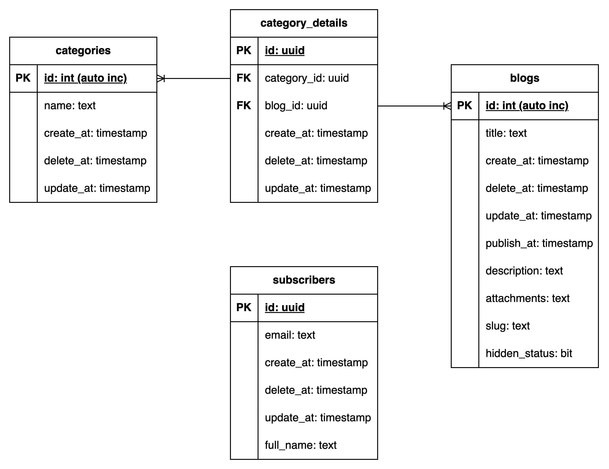

# Personal blog platform

> *This is a personal blog platform SSR WebApp using Spring and PostgreSQL.*

<div align="center">
  
  <p align="center" style="font-style: italic; color: #999;">
    Personal blog platform's database diagram
  </p>
</div>

## Database scripts

### Create table script

```sql
CREATE DATABASE "blog-platform"
    WITH
    OWNER = postgres
    ENCODING = 'UTF8'
    LC_COLLATE = 'C'
    LC_CTYPE = 'C'
    LOCALE_PROVIDER = 'libc'
    TABLESPACE = pg_default
    CONNECTION LIMIT = -1
    IS_TEMPLATE = False;

COMMENT ON DATABASE "blog-platform"
    IS 'A database for storing blog of a personal blog platform';
```

### Blogs table

Script for sequence of `id`:

```sql
CREATE SEQUENCE IF NOT EXISTS public.blogs_id_seq
    INCREMENT 1
    START 1
    MINVALUE 1
    MAXVALUE 2147483647
    CACHE 1
    OWNED BY blogs.id;

ALTER SEQUENCE public.blogs_id_seq
    OWNER TO postgres;
```

Script for table:

```sql
CREATE TABLE IF NOT EXISTS public.blogs
(
    id integer NOT NULL DEFAULT nextval('blogs_id_seq'::regclass),
    title text COLLATE pg_catalog."default" NOT NULL,
    description text COLLATE pg_catalog."default" NOT NULL,
    attachment text COLLATE pg_catalog."default" NOT NULL,
    slug text COLLATE pg_catalog."default" NOT NULL,
    hidden_status boolean DEFAULT false,
    create_at timestamp without time zone NOT NULL,
    update_at timestamp without time zone NOT NULL,
    delete_at timestamp without time zone,
    publish_at timestamp without time zone,
    CONSTRAINT blogs_pkey PRIMARY KEY (id),
    CONSTRAINT "unique blog title" UNIQUE (title)
)

TABLESPACE pg_default;

ALTER TABLE IF EXISTS public.blogs
    OWNER to postgres;
```

### Categories table

Script for sequence of `id`:

```sql
CREATE SEQUENCE IF NOT EXISTS public.categories_id_seq
    INCREMENT 1
    START 1
    MINVALUE 1
    MAXVALUE 2147483647
    CACHE 1
    OWNED BY categories.id;

ALTER SEQUENCE public.categories_id_seq
    OWNER TO postgres;
```

Script for table:

```sql
CREATE TABLE IF NOT EXISTS public.categories
(
    id integer NOT NULL DEFAULT nextval('categories_id_seq'::regclass),
    name text COLLATE pg_catalog."default" NOT NULL,
    create_at timestamp without time zone NOT NULL,
    update_at timestamp without time zone NOT NULL,
    delete_at timestamp without time zone,
    CONSTRAINT categories_pkey PRIMARY KEY (id),
    CONSTRAINT "Unique category name" UNIQUE (name)
)

TABLESPACE pg_default;

ALTER TABLE IF EXISTS public.categories
    OWNER to postgres;
```

### Category_details table

Script for sequence of `category_id`:

```sql
CREATE SEQUENCE IF NOT EXISTS public.category_details_category_id_seq
    INCREMENT 1
    START 1
    MINVALUE 1
    MAXVALUE 2147483647
    CACHE 1
    OWNED BY category_details.category_id;

ALTER SEQUENCE public.category_details_category_id_seq
    OWNER TO postgres;
```

Script for sequence of `blog_id`:

```sql
CREATE SEQUENCE IF NOT EXISTS public.category_details_blog_id_seq
    INCREMENT 1
    START 1
    MINVALUE 1
    MAXVALUE 2147483647
    CACHE 1
    OWNED BY category_details.blog_id;

ALTER SEQUENCE public.category_details_blog_id_seq
    OWNER TO postgres;
```

Script for table:

```sql
CREATE TABLE IF NOT EXISTS public.category_details
(
    id uuid DEFAULT uuid_generate_v4(),
    category_id integer NOT NULL DEFAULT nextval('category_details_category_id_seq'::regclass),
    blog_id integer NOT NULL DEFAULT nextval('category_details_blog_id_seq'::regclass),
    create_at timestamp without time zone NOT NULL,
    update_at timestamp without time zone NOT NULL,
    delete_at timestamp without time zone,
    CONSTRAINT "Category Detail FK category" FOREIGN KEY (category_id)
        REFERENCES public.categories (id) MATCH SIMPLE
        ON UPDATE CASCADE
        ON DELETE NO ACTION,
    CONSTRAINT "Category Detail FL blog" FOREIGN KEY (blog_id)
        REFERENCES public.blogs (id) MATCH SIMPLE
        ON UPDATE CASCADE
        ON DELETE NO ACTION
)

TABLESPACE pg_default;

ALTER TABLE IF EXISTS public.category_details
    OWNER to postgres;
```

### Subscribers table

```sql
CREATE TABLE IF NOT EXISTS public.subscribers
(
    id uuid NOT NULL DEFAULT uuid_generate_v4(),
    email text COLLATE pg_catalog."default" NOT NULL,
    full_name text COLLATE pg_catalog."default" NOT NULL,
    create_at timestamp without time zone NOT NULL,
    update_at timestamp without time zone NOT NULL,
    delete_at timestamp without time zone,
    CONSTRAINT subscribers_pkey PRIMARY KEY (id),
    CONSTRAINT "Unique subscriber email" UNIQUE (email)
)

TABLESPACE pg_default;

ALTER TABLE IF EXISTS public.subscribers
    OWNER to postgres;
```

## Run project

Requirements:

- IDE: Intellij IDEA Ultimate version
- DBMS: PostgreSQL
- DBMS client: can use Intellij IDEA intergrated database connection or PgAdmin app.
- Tomcat: version 9

Step-by-step guide:

1. Clone the project.
2. Open the project inside Intellij.
3. Intergrate Tomcat into IDE.
4. Run the app.
