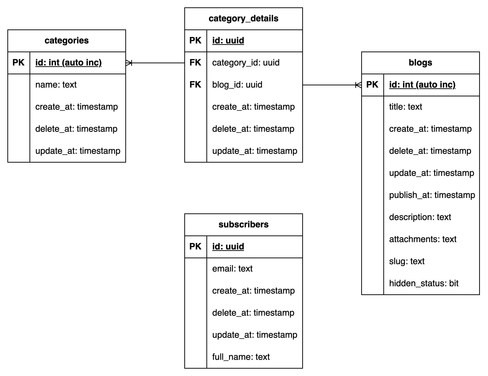

# Personal blog platform

> *This is a personal blog platform SSR WebApp using Spring and PostgreSQL.*

<div align="center">
  
  <p align="center" style="font-style: italic; color: #999;">
    Personal blog platform's database diagram
  </p>
</div>

## Database

DBMS: PostgreSQL

Database scripts can be found at: [scripts](./scripts/).

## Run project

**Requirements:**

- IDE: Intellij IDEA Ultimate version
- DBMS: PostgreSQL
- DBMS client: can use Intellij IDEA intergrated database connection or PgAdmin app.
- Tomcat: version 9

**Step-by-step guide:**

1. Clone the project.
2. Intergrate Tomcat into IDE.
3. Open the project inside Intellij.
4. Configure the `spring-config-mvc.xml` file.

  Since there are a differences in database configuration of each computer, I will ignore the bean configuration file and let you config it yourself with the file template:
  
  `spring-config-mvc.xml`

  ```xml
  <?xml version="1.0" encoding="UTF-8"?>
    <beans xmlns="http://www.springframework.org/schema/beans"
          xmlns:xsi="http://www.w3.org/2001/XMLSchema-instance"
          xmlns:context="http://www.springframework.org/schema/context"
          xmlns:p="http://www.springframework.org/schema/p"
          xmlns:tx="http://www.springframework.org/schema/tx"
          xmlns:mvc="http://www.springframework.org/schema/mvc"
          xsi:schemaLocation="http://www.springframework.org/schema/beans
            http://www.springframework.org/schema/beans/spring-beans.xsd
            http://www.springframework.org/schema/context
            http://www.springframework.org/schema/context/spring-context.xsd
            http://www.springframework.org/schema/tx
          http://www.springframework.org/schema/tx/spring-tx.xsd
          http://www.springframework.org/schema/mvc
          http://www.springframework.org/schema/mvc/spring-mvc.xsd">

        <!-- Spring MVC Annotation -->
        <context:annotation-config />
        <mvc:annotation-driven/>

      <!-- * This bean is for file load -->
      <!--    <bean id="multipartResolver" class="org.springframework.web.multipart.commons.CommonsMultipartResolver">-->
      <!--        <property name="maxUploadSize" value="20971520"/>-->
      <!--    </bean>-->

      <!-- * This bean is for mail sending service -->
      <!--    <bean id="mailSender" class="org.springframework.mail.javamail.JavaMailSenderImpl">-->
      <!--        <property name="host" value="smtp.gmail.com"/>-->
      <!--        <property name="port" value="587"/>-->
      <!--        <property name="username" value="nnminh.sam.1803@gmail.com"/>-->
      <!--        <property name="password" value="gleetqoxykdjalws"/>-->
      <!--        <property name="defaultEncoding" value="UTF-8"/>-->
      <!--        <property name="javaMailProperties">-->
      <!--            <props>-->
      <!--                <prop key="mail.smtp.auth">true</prop>-->
      <!--                <prop key="mail.smtp.socketFactory.class">javax.net.ssl.SSLSocketFactory</prop>-->
      <!--                <prop key="mail.smtp.socketFactory.port">465</prop>-->
      <!--                <prop key="mail.smtp.starttls.enable">false</prop>-->
      <!--                <prop key="mail.debug">true</prop>-->
      <!--            </props>-->
      <!--        </property>-->
      <!--    </bean>-->

        <!-- TODO: configure your data source here -->
        <bean id="dataSource"
              class="org.springframework.jdbc.datasource.DriverManagerDataSource"
              p:driverClassName="org.postgresql.Driver" 
              p:url="jdbc:postgresql://localhost:<Database port>/blog-platform"
              p:username="<login name>"
              p:password="<password>">
        </bean>

        <bean id="sessionFactory" class="org.springframework.orm.hibernate4.LocalSessionFactoryBean">
            <property name="dataSource" ref="dataSource"/>
            <property name="hibernateProperties">
                <props>
                    <prop key="hibernate.dialect">org.hibernate.dialect.PostgresPlusDialect</prop>
                    <prop key="hibernate.show_sql">true</prop>
                </props>
            </property>
            <property name="packagesToScan" value="com.proj.projblogplatform.model"/>
        </bean>

        <bean id="transactionManager"
              class="org.springframework.orm.hibernate4.HibernateTransactionManager"
              p:sessionFactory-ref="sessionFactory"/>
        <tx:annotation-driven transaction-manager="transactionManager"/>

        <bean id="viewResolver"
              p:prefix="/WEB-INF/views/" p:suffix=".jsp"
              class="org.springframework.web.servlet.view.InternalResourceViewResolver"/>

        <context:component-scan base-package="com.proj.projblogplatform.controller"/>
        <context:component-scan base-package="com.proj.projblogplatform.service"/>
        <context:component-scan base-package="com.proj.projblogplatform.repository"/>
        <context:component-scan base-package="com.proj.projblogplatform.model"/>
    </beans>
  ```

  Inside the file, there will be a TODO section, read it carefully and fillout the missing data `<data>` and copy this file into `src/mainwebapp/WEB-INF/configs/spring-config-mvc.xml` file in your project directory.

  Note that when you create the `.xml` file inside Intellij, the IDE will put a small promt that the top of the editor, it's asking you if you want to add this file as a spring configuration for the project, you just need to follow the instructions and you should be ok.

5. Run the app.
